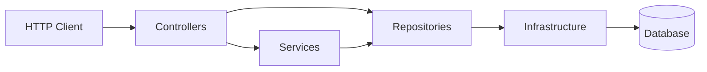

## API Blog Comments

Versao em portugues: [README.md](README.md)

HTTP API in ASP.NET Core for blog posts, comments, and JWT-based authentication.
The project is intentionally small, but built around explicit architectural decisions: real persistence, ownership-based authorization, runtime OpenAPI documentation, and integration tests.

### Status

The project is already ready as a technical boilerplate for small and medium APIs that need authentication, simple authorization, relational persistence, versioned migrations, minimal observability, and executable documentation.

It is not structurally incomplete. What remains from this point on are evolutions for scale, distributed operation, and additional production hardening.

### Quick read

If the goal is to evaluate the repository quickly, these are the main points:

- real persistence with Dapper and explicit SQL
- JWT authentication with Argon2id password hashing
- role- and ownership-based authorization
- versioned migrations with history
- minimal observability with `ProblemDetails`, correlation id, and health checks
- runtime documentation through OpenAPI and Scalar
- integration tests covering the HTTP surface

### Scope

- post and comment CRUD
- JWT-based authentication
- `Author` and `Admin` roles
- resource ownership authorization
- static and runtime OpenAPI contract

### Architectural decisions

The formal record of those decisions is available in [docs/adr/README.en.md](docs/adr/README.en.md).

| Decision | Why | Trade-off |
| --- | --- | --- |
| ASP.NET Core with minimal hosting | Straight bootstrap and easy-to-read application composition | `Program.cs` accumulates more responsibilities |
| Dapper for data access | Explicit, predictable SQL that is easy to inspect | Less automation than a full ORM |
| `IDbConnectionFactory` with configurable provider | Reduces coupling to the current database provider | Provider differences still need manual handling |
| SQLite as the local default | Simple execution with real persistence | It is not enough by itself for more demanding production scenarios |
| Versioned migrations with history | Explicit schema evolution without opaque bootstrap logic | Rollback and external migration pipelines are still outside the baseline |
| Argon2id for passwords | Real authentication hardening | Higher CPU cost during login and registration |
| JWT with identity claims and named policies | Stateless authentication with explicit authorization at bootstrap | Fine-grained token revocation remains out of scope |
| Ownership on posts and comments | Access control lives in the domain, not only at the endpoint edge | Rules and queries become more detailed |
| Runtime OpenAPI with Scalar | Navigable contract aligned with runtime behavior | Documentation exposure must still be controlled per environment |
| Integration tests with `WebApplicationFactory` | Validation close to real API behavior | The suite is heavier than purely unit-based testing |

### Logical structure



### Domain and security rules

- registered users receive the `Author` role
- `Admin` users can edit and remove any resource
- `Author` users can only modify resources they created
- there is no automatic admin seed at startup
- the JWT key must be provided externally at runtime
- authentication routes are rate limited
- the schema is controlled by migrations recorded in `__SchemaMigrations`

### Contract and documentation

- static specification in [OpenAPI.yaml](OpenAPI.yaml)
- documentation hub in [docs/index.en.md](docs/index.en.md)
- Portuguese documentation hub in [docs/index.md](docs/index.md)
- ADRs in [docs/adr/README.en.md](docs/adr/README.en.md)
- technical case in [docs/technical-case.en.md](docs/technical-case.en.md)
- technical backlog in [docs/api-technical-backlog.en.md](docs/api-technical-backlog.en.md)
- runtime document at `/docs/openapi/v1.json` when enabled
- interactive interface at `/docs` when enabled

### Local operations

To support demos and local maintenance without reintroducing automatic seed behavior into runtime, the repository exposes explicit commands:

```bash
bash scripts/migration-status.sh
bash scripts/reset-local-db.sh
bash scripts/rebuild-demo-db.sh
bash scripts/seed-demo-db.sh
```

The status command shows the current state of known migrations without applying anything implicitly.
The reset command recreates the local SQLite database with the current schema. The seed command populates the local database with demo data and the users below:

- `demo-admin / DemoAdmin123!`
- `demo-author / DemoAuthor123!`
- `demo-author-2 / DemoAuthorTwo123!`

The `rebuild-demo-db` command runs reset followed by seed and is the most practical option for quickly reviewing the demo.

These commands are meant for the local SQLite environment and do not run automatically during API startup.

### Local run

Before starting the API outside Docker, configure a valid JWT key. The application fails during startup if `Jwt:Key` is empty, still uses the placeholder, or has fewer than 32 characters.

For local development, the most practical option is user-secrets:

```bash
dotnet user-secrets set "Jwt:Key" "dev-local-jwt-secret-key-with-32chars-minimum" --project api-blog-comments-dev/api-blog-comments-dev.csproj
dotnet run --project api-blog-comments-dev/api-blog-comments-dev.csproj
```

If preferred, the key can also be supplied through an environment variable:

```bash
Jwt__Key="dev-local-jwt-secret-key-with-32chars-minimum" dotnet run --project api-blog-comments-dev/api-blog-comments-dev.csproj
```

The list endpoints below are paginated through `page` and `pageSize` query parameters.

### What is still outside the baseline

- SQL Server as the primary operational runtime
- ownership checks fused directly into SQL write operations
- post detail payload reduction so it no longer loads every comment
- metrics and tracing beyond the current minimal observability layer
- session strategy with refresh tokens or JWT revocation

### How to read this project

- as boilerplate: a lean baseline that is already operationally serious
- as portfolio material: a repository that keeps decisions and trade-offs visible
- as reference code: an example of a small API that does not hide persistence, authentication, or authorization behind ornamental abstractions

### Quick usage walkthrough

1. Create a user.

```bash
curl -X POST http://localhost:5245/api/auth/register \
  -H "Content-Type: application/json" \
  -d '{"username": "luciano", "password": "senha-segura-123"}'
```

2. Store the returned token and use it in `Authorization: Bearer {token}`.

3. Create a post.

```bash
curl -X POST http://localhost:5245/api/posts \
  -H "Content-Type: application/json" \
  -H "Authorization: Bearer {token}" \
  -d '{"title": "First post", "content": "Post content"}'
```

4. Query the post.

```bash
curl http://localhost:5245/api/posts/1
```

5. Add a comment.

```bash
curl -X POST http://localhost:5245/api/posts/1/comments \
  -H "Content-Type: application/json" \
  -H "Authorization: Bearer {token}" \
  -d '{"text": "First comment"}'
```

### Main API surface

| Method | Route | Authentication | Purpose |
| --- | --- | --- | --- |
| GET | `/api/posts` | No | List posts with pagination |
| GET | `/api/posts/{id}` | No | Get a post with comments |
| POST | `/api/posts` | Yes | Create post |
| PUT | `/api/posts/{id}` | Yes | Update post |
| DELETE | `/api/posts/{id}` | Yes | Remove post |
| GET | `/api/posts/{id}/comments` | No | List comments for a post with pagination |
| GET | `/api/posts/{id}/comments/{commentId}` | No | Get a comment |
| POST | `/api/posts/{id}/comments` | Yes | Create comment |
| PUT | `/api/posts/{id}/comments/{commentId}` | Yes | Update comment |
| DELETE | `/api/posts/{id}/comments/{commentId}` | Yes | Remove comment |
| POST | `/api/auth/register` | No | Register user |
| POST | `/api/auth/login` | No | Authenticate user |
| GET | `/api/auth/me` | Yes | Get authenticated user profile |