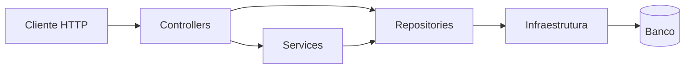

## API Blog Comments

Versao em ingles: [README.en.md](README.en.md)

API HTTP em ASP.NET Core para posts, comentários e autenticação baseada em JWT.
O projeto foi mantido pequeno de propósito, mas com decisões de arquitetura explícitas: persistência real, autorização por ownership, documentação OpenAPI em runtime e testes de integração.
Boilerplate para APIs em .NET com modelo de negócios básico.

### Status

O projeto está pronto como boilerplate técnico para APIs pequenas e médias com autenticação, autorização simples, persistência relacional, migrações versionadas, observabilidade mínima e documentação executável.


### Leitura rápida

Se a intenção é avaliar o repositório rapidamente, os pontos centrais são estes:

- persistência real com Dapper e SQL explícito
- autenticação com JWT e hashing com Argon2id
- autorização por papel e ownership
- migrações versionadas com histórico
- observabilidade minima com `ProblemDetails`, id de correlacao e health checks
- documentação runtime com OpenAPI e Scalar
- testes de integração cobrindo a superfície HTTP

### Escopo

- CRUD de posts e comentários
- autenticação com JWT
- papéis `Author` e `Admin`
- autorização por autoria do recurso
- contrato OpenAPI estático e runtime

### Decisões arquiteturais

O histórico formal dessas decisões está em [docs/adr/README.md](docs/adr/README.md).

| Decisão | Justificativa | Trade-off |
| --- | --- | --- |
| ASP.NET Core com minimal hosting | Bootstrap direto e leitura simples da composição da API | `Program.cs` concentra mais responsabilidades |
| Dapper no acesso a dados | SQL explícito, previsível e fácil de inspecionar | Menos automação do que um ORM completo |
| `IDbConnectionFactory` com provider configurável | Reduz acoplamento entre aplicação e banco atual | Diferenças entre providers continuam tratadas manualmente |
| SQLite como padrão local | Execução simples com persistência real | Não cobre sozinho cenários mais exigentes de produção |
| Migrações versionadas com histórico | Evolução explícita de schema sem depender de bootstrap opaco | Rollback e pipeline externo de migração ainda não fazem parte da base |
| Argon2id para senha | Endurecimento real da autenticação | Maior custo computacional no login e cadastro |
| JWT com claims de identidade e policies nomeadas | Autenticação stateless com autorização explícita no bootstrap da aplicação | Revogação fina de token fica fora do escopo |
| Ownership em posts e comentários | Controle de acesso no domínio, não só no endpoint | Regras e queries ficam mais detalhadas |
| OpenAPI runtime com Scalar | Contrato navegável e alinhado ao runtime | Superfície de documentação precisa ser tratada por ambiente |
| Testes de integração com `WebApplicationFactory` | Validação próxima do comportamento real da API | Suíte mais pesada do que testes puramente unitários |

### Estrutura lógica



### Regras de domínio e segurança

- usuários cadastrados recebem o papel `Author`
- usuários `Admin` podem editar e remover qualquer recurso
- usuários `Author` só podem alterar recursos de própria autoria
- não existe seed automático de usuário administrativo
- a chave JWT deve ser fornecida externamente em runtime
- as rotas de autenticação possuem rate limiting
- o schema é controlado por migrações registradas em `__SchemaMigrations`

### Contrato e documentação

- especificação estática em [OpenAPI.yaml](OpenAPI.yaml)
- documentação central em [docs/index.md](docs/index.md)
- versão em inglês da documentação central em [docs/index.en.md](docs/index.en.md)
- ADRs em [docs/adr/README.md](docs/adr/README.md)
- case técnico em [docs/case-tecnico.md](docs/case-tecnico.md)
- backlog técnico em [docs/backlog-tecnico-api.md](docs/backlog-tecnico-api.md)
- documento runtime em `/docs/openapi/v1.json` quando habilitado
- interface interativa em `/docs` quando habilitada

### Operações locais

Para facilitar demo e manutenção local sem recolocar seed automático no runtime, o repositório expõe comandos explícitos:

```bash
bash scripts/migration-status.sh
bash scripts/reset-local-db.sh
bash scripts/rebuild-demo-db.sh
bash scripts/seed-demo-db.sh
```

O comando de status mostra o estado local das migrações conhecidas sem aplicar nada por trás.
O reset recria o banco SQLite local com o schema atual. O seed popula o banco local com dados de demonstração e os usuários abaixo:

- `demo-admin / DemoAdmin123!`
- `demo-author / DemoAuthor123!`
- `demo-author-2 / DemoAuthorTwo123!`

O comando `rebuild-demo-db` executa reset seguido de seed e é a opção mais prática para revisar a demo rapidamente.

Esses comandos são voltados para ambiente local com SQLite e não rodam automaticamente no startup da API.

### Execução local

Antes de subir a API fora do container, configure uma chave JWT válida. A aplicação falha no startup se `Jwt:Key` estiver vazia, com placeholder ou com menos de 32 caracteres.

Uma opção prática para desenvolvimento local é usar user-secrets:

```bash
dotnet user-secrets set "Jwt:Key" "dev-local-jwt-secret-key-with-32chars-minimum" --project api-blog-comments-dev/api-blog-comments-dev.csproj
dotnet run --project api-blog-comments-dev/api-blog-comments-dev.csproj
```

Se preferir, a chave também pode ser fornecida por variável de ambiente:

```bash
Jwt__Key="dev-local-jwt-secret-key-with-32chars-minimum" dotnet run --project api-blog-comments-dev/api-blog-comments-dev.csproj
```

### Docker

Para validar a API em container com a configuracao de producao simplificada:

```bash
JWT_KEY="sua-chave-jwt-com-pelo-menos-32-caracteres" docker compose up --build
```

Se a porta `5000` estiver ocupada no host, publique em outra porta:

```bash
HOST_PORT=5080 JWT_KEY="sua-chave-jwt-com-pelo-menos-32-caracteres" docker compose up --build
```

O compose agora persiste chaves de DataProtection em volume dedicado e desabilita o redirecionamento HTTPS dentro do container local, evitando avisos desnecessarios no cenário sem terminacao TLS interna.

### O que ainda não faz parte da base

- SQL Server como runtime operacional principal
- ownership checks fundidos diretamente nas operações SQL de escrita
- redução do payload do detalhe do post para não carregar todos os comentários
- métricas e tracing além da observabilidade mínima atual
- estratégia de sessão com refresh token ou revogação de JWT

### Como ler este projeto

- como boilerplate: uma base enxuta, mas já operacionalmente séria
- como portfólio: um repositório que deixa decisões e trade-offs explícitos
- como referência: um exemplo de API pequena sem esconder persistência, autenticação ou autorização atrás de abstrações decorativas

### Tutorial rápido de uso

1. Crie um usuário.

```bash
curl -X POST http://localhost:5245/api/auth/register \
  -H "Content-Type: application/json" \
  -d '{"username": "luciano", "password": "senha-segura-123"}'
```

2. Guarde o token retornado e use em `Authorization: Bearer {token}`.

3. Crie um post.

```bash
curl -X POST http://localhost:5245/api/posts \
  -H "Content-Type: application/json" \
  -H "Authorization: Bearer {token}" \
  -d '{"title": "Primeiro post", "content": "Conteudo do post"}'
```

4. Consulte o post.

```bash
curl http://localhost:5245/api/posts/1
```

5. Adicione um comentário.

```bash
curl -X POST http://localhost:5245/api/posts/1/comments \
  -H "Content-Type: application/json" \
  -H "Authorization: Bearer {token}" \
  -d '{"text": "Primeiro comentario"}'
```

### Superfície principal da API

| Método | Rota | Autenticação | Finalidade |
| --- | --- | --- | --- |
| GET | `/api/posts` | Não | Listar posts de forma paginada |
| GET | `/api/posts/{id}` | Não | Consultar post com comentários |
| POST | `/api/posts` | Sim | Criar post |
| PUT | `/api/posts/{id}` | Sim | Atualizar post |
| DELETE | `/api/posts/{id}` | Sim | Remover post |
| GET | `/api/posts/{id}/comments` | Não | Listar comentários de um post de forma paginada |
| GET | `/api/posts/{id}/comments/{commentId}` | Não | Consultar comentário |
| POST | `/api/posts/{id}/comments` | Sim | Criar comentário |
| PUT | `/api/posts/{id}/comments/{commentId}` | Sim | Atualizar comentário |
| DELETE | `/api/posts/{id}/comments/{commentId}` | Sim | Remover comentário |
| POST | `/api/auth/register` | Não | Cadastrar usuário |
| POST | `/api/auth/login` | Não | Autenticar usuário |
| GET | `/api/auth/me` | Sim | Consultar usuário autenticado |
