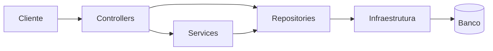

# API Blog Comments como base arquitetural de API pequena

Versao em ingles: [portfolio-article.en.md](portfolio-article.en.md)

## Síntese

API Blog Comments é uma API pequena construída com foco em fundação técnica, não em volume funcional. O projeto foi organizado para manter explícitas as decisões de persistência, autenticação, autorização e documentação.

Como material de portfólio, o ponto forte não é a quantidade de endpoints. É a forma como uma base pequena continua tecnicamente legível, defensável e operacionalmente honesta.

## Fundamentos

- OpenAPI em runtime e especificação estática
- persistência real com SQL explícito
- autenticação com JWT e hashing com Argon2id
- autorização por papel e ownership
- separação entre controllers, services e repositories
- testes de integração sobre a superfície HTTP

## Estrutura

## Adequação

Este modelo é adequado quando o objetivo é:

- demonstrar arquitetura de API com baixa ambiguidade técnica
- preservar visibilidade sobre o acesso a dados
- iniciar uma base pequena sem abrir mão de requisitos estruturais
- manter o repositório como referência técnica

## Limites

Outra direção passaria a fazer mais sentido em domínios com agregados mais complexos, forte dependência de tracking automatizado ou políticas de autorização significativamente mais granulares.

## Encerramento

O projeto foi calibrado para mostrar uma base pequena, legível e tecnicamente defensável. O ponto central está na fundação arquitetural.

Isso faz dele uma boa vitrine para discutir decisões, trade-offs e critérios de simplificação sem cair em arquitetura ornamental.