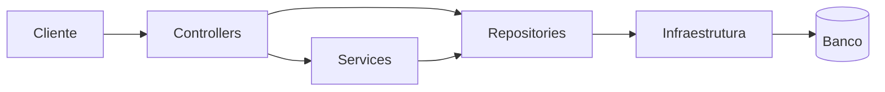

# Case Técnico: API Blog Comments

Versao em ingles: [technical-case.en.md](technical-case.en.md)

## Resumo executivo

API Blog Comments é uma base técnica para uma API HTTP pequena com persistência, autenticação, autorização, documentação e testes.
O projeto foi mantido enxuto para preservar legibilidade arquitetural e explicitar trade-offs.

No estado atual, ele já pode ser tratado como boilerplate funcional para novas APIs com necessidades semelhantes.

Em termos de portfólio, o repositório funciona bem porque mostra decisões reais de engenharia em uma base pequena, em vez de simular complexidade que o problema não exige.

## Contexto

O problema tratado aqui não é escala funcional. O foco está em construir uma base pequena sem retirar preocupações estruturais como persistência real, segurança de credenciais, ownership e documentação executável.

## Objetivo arquitetural

Estabelecer uma base técnica que deixe claros:

- separação de responsabilidades entre camada HTTP, regras de negócio e acesso a dados
- autenticação baseada em JWT com senhas protegidas por Argon2id
- autorização por papel e ownership de recurso
- documentação OpenAPI exposta em runtime e mantida em especificação estática
- testes de integração cobrindo fluxos relevantes do sistema

## Decisões estruturantes

### Documentação

- adoção de OpenAPI em runtime como contrato operacional da API
- uso de Scalar como interface de consulta ao contrato runtime
- manutenção de especificação estática no repositório para revisão e integração com ferramentas externas

### Persistência

- SQLite como provedor padrão para execução local e testes simples de adoção
- Dapper como mecanismo de acesso a dados, preservando visibilidade sobre SQL e comportamento do banco
- abstração de conexão por `IDbConnectionFactory`, reduzindo acoplamento com o provedor corrente
- migrações versionadas com histórico em `__SchemaMigrations`, permitindo evolução explícita de schema

### Segurança

- hashing de senha com Argon2id
- emissão de JWT com claims de identidade e papel
- modelo de autorização baseado em `Author`, `Admin`, policies nomeadas e autoria do recurso
- rate limiting nas rotas de autenticação
- ausência de credenciais padrão ou fluxos implícitos de bootstrap em runtime

### Validação

- testes de integração com `WebApplicationFactory`
- banco SQLite isolado para execução da suíte
- cobertura de autenticação, autorização, CRUD, OpenAPI, health checks e disponibilidade de documentação interativa

### Operação

- `ProblemDetails` enriquecido com `traceId` e `correlationId`
- health checks separados entre liveness e readiness
- logging HTTP básico para request path, método, status e duração
- tooling explícito para reset, seed, rebuild e inspeção do status das migrações em ambiente local

## Arquitetura de referência

## Evidências

- contrato HTTP documentado e navegável
- persistência real desde o primeiro nível do projeto
- regras de autorização aplicadas ao domínio, não apenas ao endpoint
- documentação tratada como parte da arquitetura
- testes automatizados alinhados ao comportamento observado por clientes reais

## Limites

O projeto adota simplificações deliberadas:

- SQLite ainda é o runtime principal da operação local e da demo
- o detalhe do post ainda carrega todos os comentários do recurso
- ownership ainda depende de leitura prévia antes das operações de escrita
- modelo de autorização continua intencionalmente simples, sem engine de permissões finas
- acesso a dados manual com Dapper, em vez de automação de tracking de ORM completo

Essas escolhas correspondem ao tamanho do problema tratado.

## Síntese

API Blog Comments demonstra uma base pequena com postura arquitetural consistente. O valor do projeto está na fundação técnica, não na abrangência funcional.

Como peça de portfólio, ele comunica melhor maturidade técnica do que volume de funcionalidades: a leitura principal está nos trade-offs assumidos, na clareza da composição e na honestidade dos limites.
