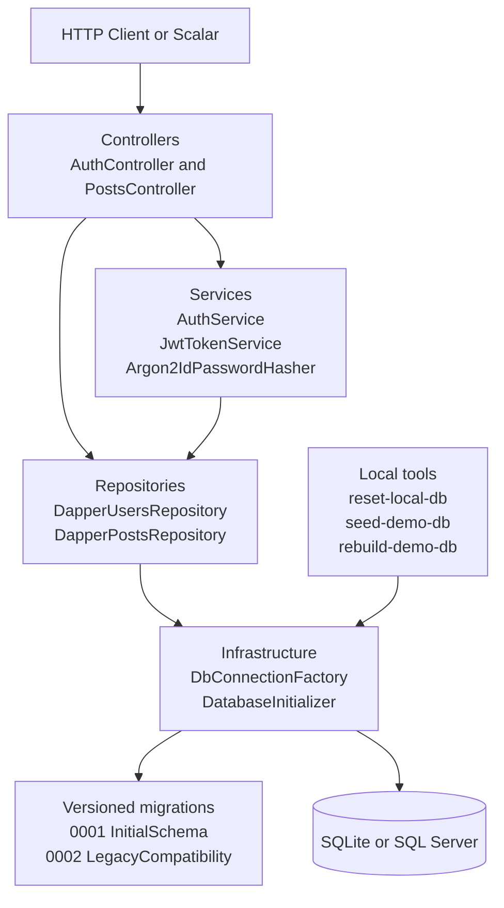

# Application layers

Versao em portugues: [camadas-da-aplicacao.md](camadas-da-aplicacao.md)

```mermaid
flowchart TB
  Client[HTTP Client or Scalar]
  Controllers[Controllers\nAuthController and PostsController]
  Services[Services\nAuthService\nJwtTokenService\nArgon2IdPasswordHasher]
  Repositories[Repositories\nDapperUsersRepository\nDapperPostsRepository]
  Infra[Infrastructure\nDbConnectionFactory\nDatabaseInitializer]
  Migrations[Versioned migrations\n0001 InitialSchema\n0002 LegacyCompatibility]
  Tools[Local tools\nreset-local-db\nseed-demo-db\nrebuild-demo-db]
  Database[(SQLite or SQL Server)]

  Client --> Controllers
  Controllers --> Services
  Controllers --> Repositories
  Services --> Repositories
  Repositories --> Infra
  Infra --> Migrations
  Infra --> Database
  Tools --> Infra
```