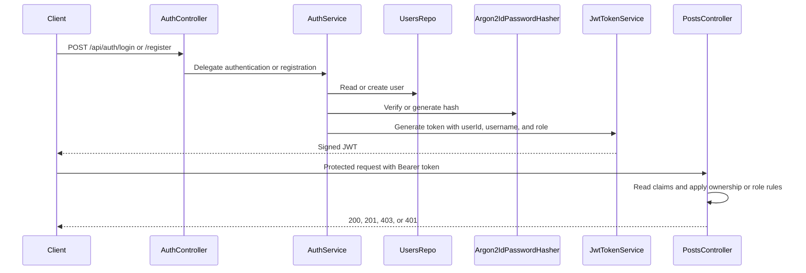

# Authentication and authorization flow

Versao em portugues: [fluxo-de-autenticacao-e-autorizacao.md](fluxo-de-autenticacao-e-autorizacao.md)

```mermaid
sequenceDiagram
  participant Client
  participant AuthController
  participant AuthService
  participant UsersRepo
  participant Hasher as Argon2IdPasswordHasher
  participant JWT as JwtTokenService
  participant PostsController

  Client->>AuthController: POST /api/auth/login or /register
  AuthController->>AuthService: Delegate authentication or registration
  AuthService->>UsersRepo: Read or create user
  AuthService->>Hasher: Verify or generate hash
  AuthService->>JWT: Generate token with userId, username, and role
  JWT-->>Client: Signed JWT
  Client->>PostsController: Protected request with Bearer token
  PostsController->>PostsController: Read claims and apply ownership or role rules
  PostsController-->>Client: 200, 201, 403, or 401
```