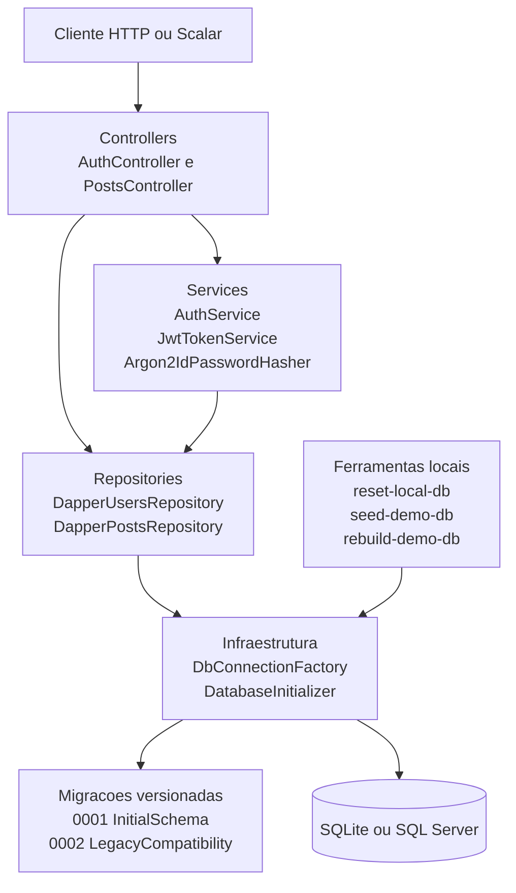

# Camadas da aplicação

Versao em ingles: [application-layers.en.md](application-layers.en.md)

```mermaid
flowchart TB
  Cliente[Cliente HTTP ou Scalar]
  Controllers[Controllers\nAuthController e PostsController]
  Services[Services\nAuthService\nJwtTokenService\nArgon2IdPasswordHasher]
  Repositories[Repositories\nDapperUsersRepository\nDapperPostsRepository]
  Infra[Infraestrutura\nDbConnectionFactory\nDatabaseInitializer]
  Migrations[Migracoes versionadas\n0001 InitialSchema\n0002 LegacyCompatibility]
  Ferramentas[Ferramentas locais\nreset-local-db\nseed-demo-db\nrebuild-demo-db]
  Database[(SQLite ou SQL Server)]

  Cliente --> Controllers
  Controllers --> Services
  Controllers --> Repositories
  Services --> Repositories
  Repositories --> Infra
  Infra --> Migrations
  Infra --> Database
  Ferramentas --> Infra
```