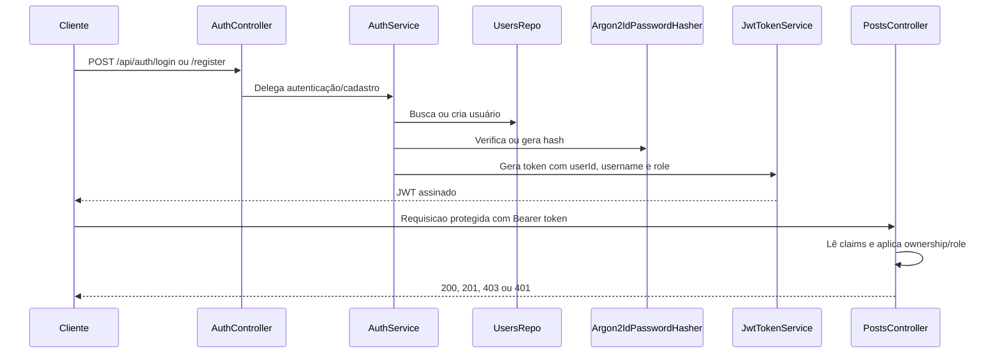

# Fluxo de autenticação e autorização

Versao em ingles: [authentication-and-authorization-flow.en.md](authentication-and-authorization-flow.en.md)

```mermaid
sequenceDiagram
  participant Cliente
  participant AuthController
  participant AuthService
  participant UsersRepo
  participant Hasher as Argon2IdPasswordHasher
  participant JWT as JwtTokenService
  participant PostsController

  Cliente->>AuthController: POST /api/auth/login ou /register
  AuthController->>AuthService: Delega autenticação/cadastro
  AuthService->>UsersRepo: Busca ou cria usuário
  AuthService->>Hasher: Verifica ou gera hash
  AuthService->>JWT: Gera token com userId, username e role
  JWT-->>Cliente: JWT assinado
  Cliente->>PostsController: Requisicao protegida com Bearer token
  PostsController->>PostsController: Lê claims e aplica ownership/role
  PostsController-->>Cliente: 200, 201, 403 ou 401
```