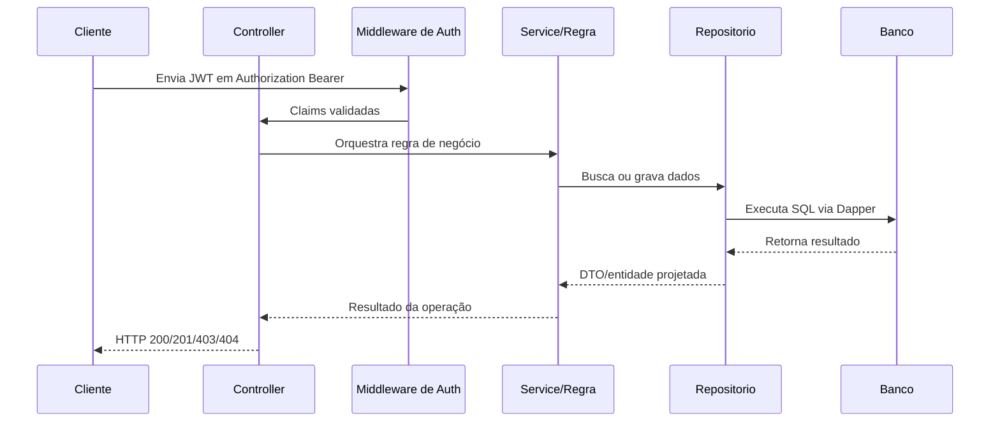

# Fluxo de requisição protegida

Versao em ingles: [protected-request-flow.en.md](protected-request-flow.en.md)

```mermaid
sequenceDiagram
  participant Cliente
  participant Controller
  participant Auth as Middleware de Auth
  participant Service as Service/Regra
  participant Repo as Repositorio
  participant DB as Banco

  Cliente->>Auth: Envia JWT em Authorization Bearer
  Auth->>Controller: Claims validadas
  Controller->>Service: Orquestra regra de negócio
  Service->>Repo: Busca ou grava dados
  Repo->>DB: Executa SQL via Dapper
  DB-->>Repo: Retorna resultado
  Repo-->>Service: DTO/entidade projetada
  Service-->>Controller: Resultado da operação
  Controller-->>Cliente: HTTP 200/201/403/404
```