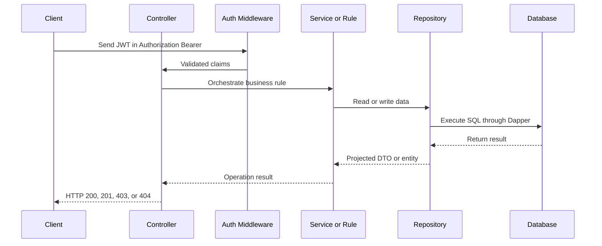

# Protected request flow

Versao em portugues: [fluxo-de-requisicao-protegida.md](fluxo-de-requisicao-protegida.md)

```mermaid
sequenceDiagram
  participant Client
  participant Controller
  participant Auth as Auth Middleware
  participant Service as Service or Rule
  participant Repo as Repository
  participant DB as Database

  Client->>Auth: Send JWT in Authorization Bearer
  Auth->>Controller: Validated claims
  Controller->>Service: Orchestrate business rule
  Service->>Repo: Read or write data
  Repo->>DB: Execute SQL through Dapper
  DB-->>Repo: Return result
  Repo-->>Service: Projected DTO or entity
  Service-->>Controller: Operation result
  Controller-->>Client: HTTP 200, 201, 403, or 404
```