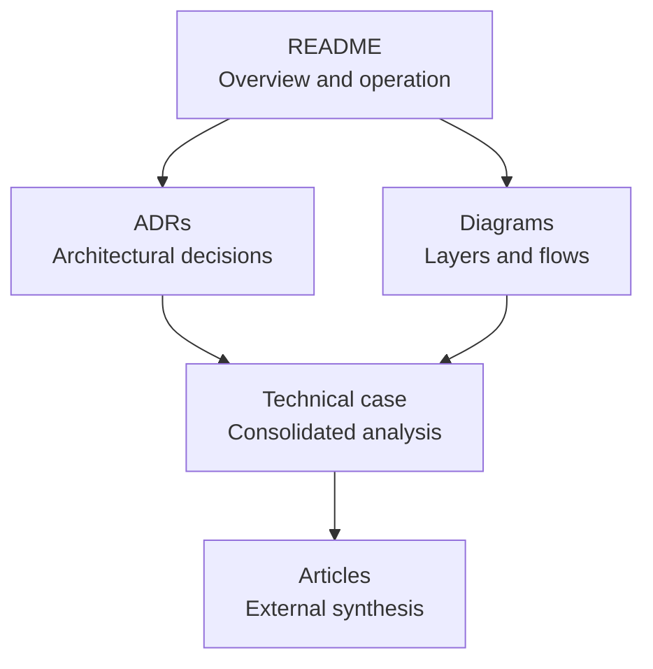

# Documentation Hub

Versao em portugues: [index.md](index.md)

This directory contains the architectural documentation for the project.

## Structure

## Index

- System overview: [../README.en.md](../README.en.md)
- Portuguese system overview: [../README.md](../README.md)
- Architectural decision records: [adr/README.en.md](adr/README.en.md)
- Supporting diagrams: [diagrams/README.en.md](diagrams/README.en.md)
- Consolidated technical analysis: [technical-case.en.md](technical-case.en.md)
- Technical backlog: [api-technical-backlog.en.md](api-technical-backlog.en.md)
- Technical article in Portuguese: [artigo-portfolio.md](artigo-portfolio.md)
- Technical article in English: [portfolio-article.en.md](portfolio-article.en.md)

## Recommended reading

1. [../README.en.md](../README.en.md)
2. [adr/README.en.md](adr/README.en.md)
3. [diagrams/README.en.md](diagrams/README.en.md)
4. [technical-case.en.md](technical-case.en.md)
5. [api-technical-backlog.en.md](api-technical-backlog.en.md)
6. [portfolio-article.en.md](portfolio-article.en.md)

## Reading paths

### Quick consultation

1. [../README.en.md](../README.en.md)
2. [diagrams/README.en.md](diagrams/README.en.md)
3. [adr/0008-dapper-versus-ef-core.en.md](adr/0008-dapper-versus-ef-core.en.md)

### Architectural evaluation

1. [../README.en.md](../README.en.md)
2. [adr/README.en.md](adr/README.en.md)
3. [technical-case.en.md](technical-case.en.md)
4. [api-technical-backlog.en.md](api-technical-backlog.en.md)

### External synthesis

1. [technical-case.en.md](technical-case.en.md)
2. [portfolio-article.en.md](portfolio-article.en.md)
3. [artigo-portfolio.md](artigo-portfolio.md)

## Role of each document

- README: overview and central decisions
- ADRs: formal record of decisions and trade-offs
- Diagrams: visual support for technical communication
- Technical case: analytical consolidation of the architecture
- Technical backlog: prioritized evolution of the API
- Articles: external synthesis of the project