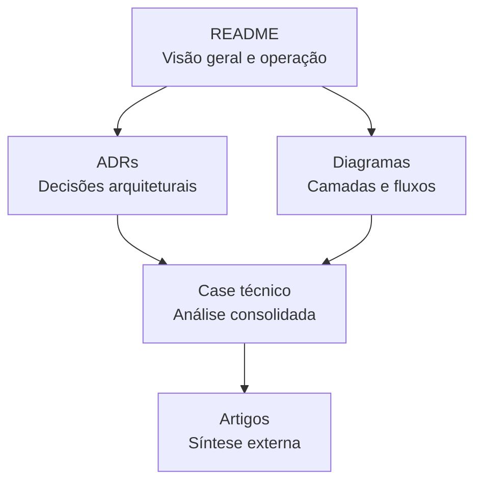

# Centro de Documentação

Versao em ingles: [index.en.md](index.en.md)

Este diretório reúne a documentação arquitetural do projeto.

## Estrutura

## Índice

- Visão geral do sistema: [README.md](../README.md)
- Visao geral do sistema em ingles: [../README.en.md](../README.en.md)
- Registro de decisões arquiteturais: [adr/README.md](adr/README.md)
- Registros de decisoes arquiteturais em ingles: [adr/README.en.md](adr/README.en.md)
- Diagramas de apoio: [diagrams/README.md](diagrams/README.md)
- Diagramas de apoio em ingles: [diagrams/README.en.md](diagrams/README.en.md)
- Análise técnica consolidada: [case-tecnico.md](case-tecnico.md)
- Case tecnico consolidado em ingles: [technical-case.en.md](technical-case.en.md)
- Backlog técnico da API: [backlog-tecnico-api.md](backlog-tecnico-api.md)
- Backlog tecnico em ingles: [api-technical-backlog.en.md](api-technical-backlog.en.md)
- Artigo técnico em português: [artigo-portfolio.md](artigo-portfolio.md)
- Artigo tecnico em ingles: [portfolio-article.en.md](portfolio-article.en.md)

## Leitura recomendada

1. [README.md](../README.md)
2. [adr/README.md](adr/README.md)
3. [diagrams/README.md](diagrams/README.md)
4. [case-tecnico.md](case-tecnico.md)
5. [backlog-tecnico-api.md](backlog-tecnico-api.md)
6. [artigo-portfolio.md](artigo-portfolio.md) ou [portfolio-article.en.md](portfolio-article.en.md)

## Trilhas

### Consulta rápida

1. [README.md](../README.md)
2. [diagrams/README.md](diagrams/README.md)
3. [adr/0008-dapper-vs-ef-core.md](adr/0008-dapper-vs-ef-core.md)

### Avaliação arquitetural

1. [README.md](../README.md)
2. [adr/README.md](adr/README.md)
3. [case-tecnico.md](case-tecnico.md)
4. [backlog-tecnico-api.md](backlog-tecnico-api.md)

### Síntese externa

1. [case-tecnico.md](case-tecnico.md)
2. [artigo-portfolio.md](artigo-portfolio.md)
3. [portfolio-article.en.md](portfolio-article.en.md)

## Papel de cada documento

- README: visão geral e decisões centrais
- ADRs: registro formal de decisões e trade-offs
- Diagramas: apoio visual para comunicação técnica
- Case técnico: consolidação analítica da arquitetura
- Backlog técnico: evolução priorizada da API
- Artigos: síntese externa do projeto