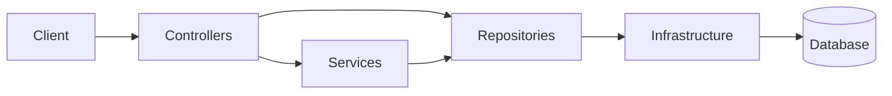

# API Blog Comments as a foundational reference for a small API

Versao em portugues: [artigo-portfolio.md](artigo-portfolio.md)

## Summary

API Blog Comments is a small HTTP API built around foundational engineering concerns rather than feature breadth. The repository keeps persistence, authentication, authorization, and documentation decisions explicit.

As portfolio material, its strength is not the number of endpoints. It is the way a small baseline remains technically readable, defensible, and operationally honest.

## Foundations

- runtime OpenAPI plus static specification
- real persistence with explicit SQL
- JWT-based authentication with Argon2id password hashing
- role- and ownership-based authorization
- separation between controllers, services, and repositories
- integration tests over the HTTP surface

## Architectural outline

## When this approach fits

This project is particularly useful when the objective is to:

- demonstrate API architecture with low technical ambiguity
- preserve visibility over executed SQL
- start from a small codebase without weakening structural concerns
- keep the repository as a technical reference

## Limits

Another direction would make more sense with more complex aggregates, stronger dependence on automated tracking, or significantly finer-grained access-control rules.

## Closing note

The project is meant to present a small, readable, and technically defensible baseline. Its value lies in the architectural foundation.

That makes it a good vehicle for discussing decisions, trade-offs, and simplification criteria without slipping into ornamental architecture.