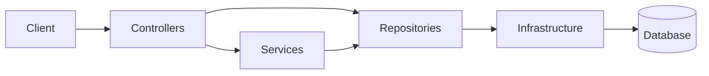

# Technical Case: API Blog Comments

Versao em portugues: [case-tecnico.md](case-tecnico.md)

## Executive summary

API Blog Comments is a technical baseline for a small HTTP API with persistence, authentication, authorization, documentation, and tests.
The project was intentionally kept lean to preserve architectural readability and make trade-offs explicit.

At its current stage, it can already be treated as a functional boilerplate for new APIs with similar needs.

As portfolio material, the repository works because it shows real engineering decisions in a small codebase instead of simulating complexity that the problem does not require.

## Context

The problem addressed here is not functional scale. The focus is to build a small baseline without stripping away structural concerns such as real persistence, credential security, ownership, and executable documentation.

## Architectural goal

Establish a technical foundation that makes the following explicit:

- separation of responsibilities between the HTTP layer, business rules, and data access
- JWT-based authentication with passwords protected by Argon2id
- authorization by role and resource ownership
- OpenAPI documentation exposed at runtime and maintained as a static specification
- integration tests covering relevant system flows

## Structuring decisions

### Documentation

- adopt runtime OpenAPI as the operational contract of the API
- use Scalar as the inspection interface for the runtime contract
- keep a static specification in the repository for review and external tooling integration

### Persistence

- SQLite as the default provider for local execution and lightweight test adoption
- Dapper as the data-access mechanism, preserving visibility into SQL and database behavior
- connection abstraction through `IDbConnectionFactory`, reducing coupling to the current provider
- versioned migrations with history in `__SchemaMigrations`, enabling explicit schema evolution

### Security

- password hashing with Argon2id
- JWT issuance with identity and role claims
- authorization model based on `Author`, `Admin`, named policies, and resource ownership
- rate limiting on authentication routes
- no default credentials or implicit bootstrap flows at runtime

### Validation

- integration tests with `WebApplicationFactory`
- isolated SQLite database for the test suite
- coverage for authentication, authorization, CRUD, OpenAPI, health checks, and interactive documentation availability

### Operation

- `ProblemDetails` enriched with `traceId` and `correlationId`
- health checks split between liveness and readiness
- basic HTTP logging for request path, method, status, and duration
- explicit tooling for reset, seed, rebuild, and migration-status inspection in the local environment

## Reference architecture

## Evidence

- documented and navigable HTTP contract
- real persistence from the first layer of the project
- authorization rules applied at the domain level, not only at the endpoint
- documentation treated as part of the architecture
- automated tests aligned with the behavior observed by real clients

## Limits

The project adopts deliberate simplifications:

- SQLite is still the main runtime for local operation and demo flows
- post detail still loads all comments for the resource
- ownership still depends on a pre-read before write operations
- the authorization model remains intentionally simple, without a fine-grained permission engine
- data access stays manual with Dapper instead of using full ORM tracking automation

Those choices match the size of the problem being addressed.

## Synthesis

API Blog Comments demonstrates a small baseline with a consistent architectural posture. Its value lies in the technical foundation rather than in functional breadth.

As a portfolio piece, it communicates technical maturity more effectively than feature volume: the main signal is in the trade-offs, the clarity of composition, and the honesty about its limits.